# User Flows

> Key user journeys through Papalote Market.

## Table of Contents

1. [Authentication Flow](#1-authentication-flow)
2. [Buyer Journey](#2-buyer-journey)
3. [Seller Onboarding](#3-seller-onboarding)
4. [Checkout Flow](#4-checkout-flow)
5. [Seller Dashboard](#5-seller-dashboard)
6. [Admin Workflows](#6-admin-workflows)

---

## 1. Authentication Flow

### Login Flow

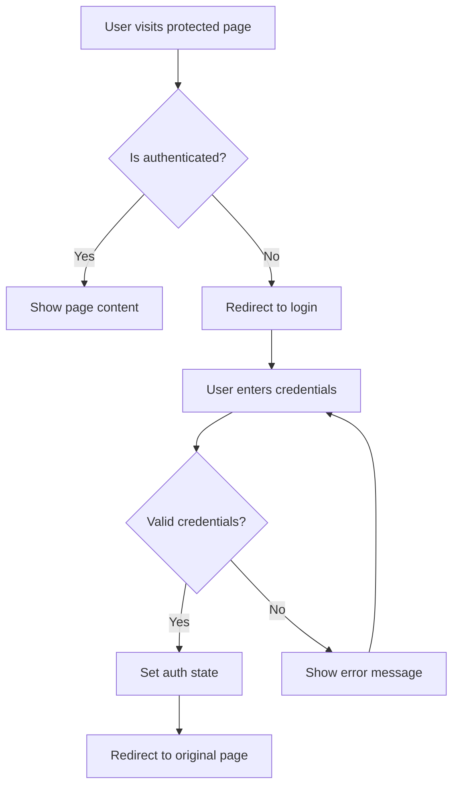

**Key Files:**

- [AuthContext.tsx](../contexts/AuthContext.tsx) - Auth state management
- [AuthPageWrapper.tsx](../components/auth/AuthPageWrapper.tsx) - Route protection
- [/iniciar-sesion](../app/iniciar-sesion/page.tsx) - Login page

### Registration Flow

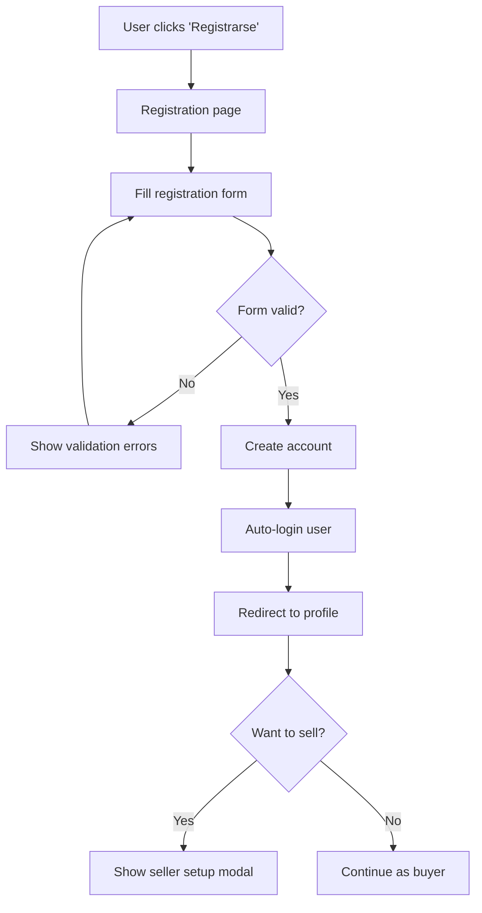

**Key Files:**

- [/registro](../app/registro/page.tsx) - Registration page
- [validators/user.ts](../validators/user.ts) - Registration schema

### User Roles

| Role     | Access Level | Key Features                |
| -------- | ------------ | --------------------------- |
| `buyer`  | Basic        | Browse, purchase, reviews   |
| `seller` | Extended     | Dashboard, products, orders |
| `admin`  | Full         | User management, settings   |

---

## 2. Buyer Journey

### Browse to Purchase

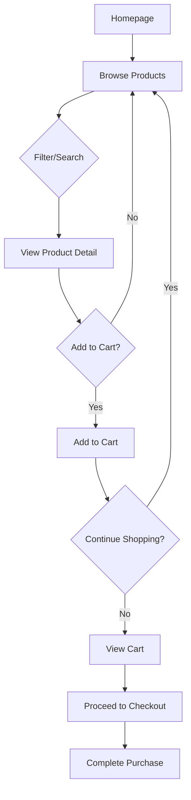

### Product Discovery

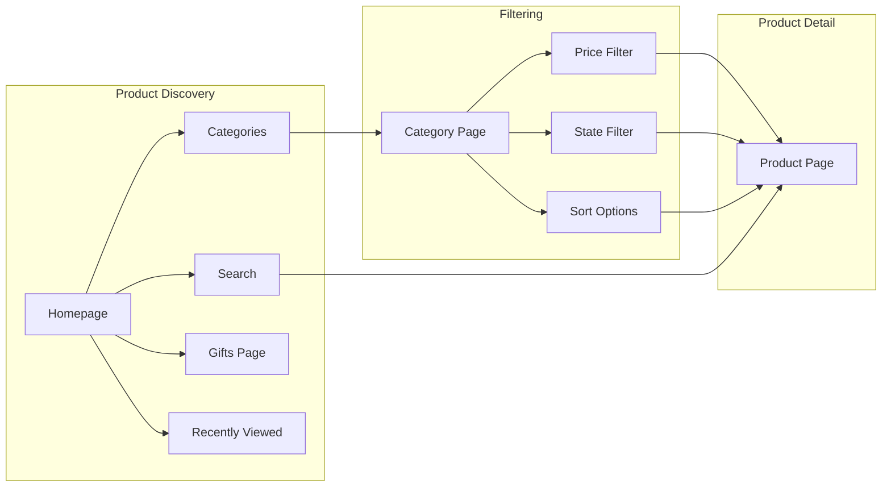

**Key Pages:**

- [/productos](../app/productos/page.tsx) - Product listing
- [/productos/[id]](../app/productos/[id]/page.tsx) - Product detail
- [/regalos](../app/regalos/page.tsx) - Gift finder
- [/categorias](../app/categorias/page.tsx) - Categories

---

## 3. Seller Onboarding

### Becoming a Seller

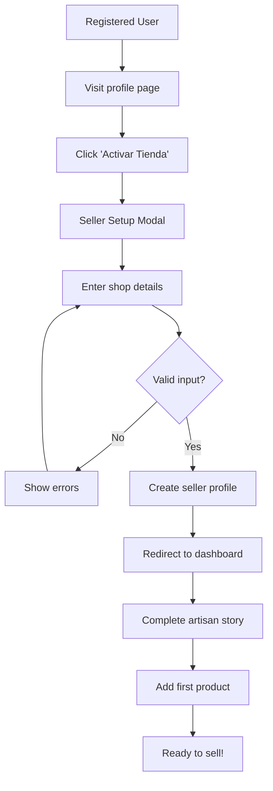

### Seller Setup Form

| Field       | Validation        | Required |
| ----------- | ----------------- | -------- |
| Shop Name   | Min 3 characters  | Yes      |
| Location    | Min 3 characters  | Yes      |
| Description | 20-300 characters | Yes      |

**Key Files:**

- [SellerSetupForm.tsx](../components/profile/SellerSetupForm.tsx) - Setup modal
- [/mi-historia](../app/mi-historia/page.tsx) - Artisan story editor

---

## 4. Checkout Flow

### Complete Checkout Process

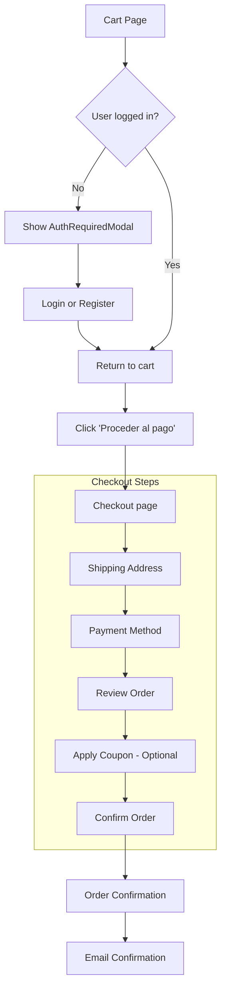

### Checkout Components

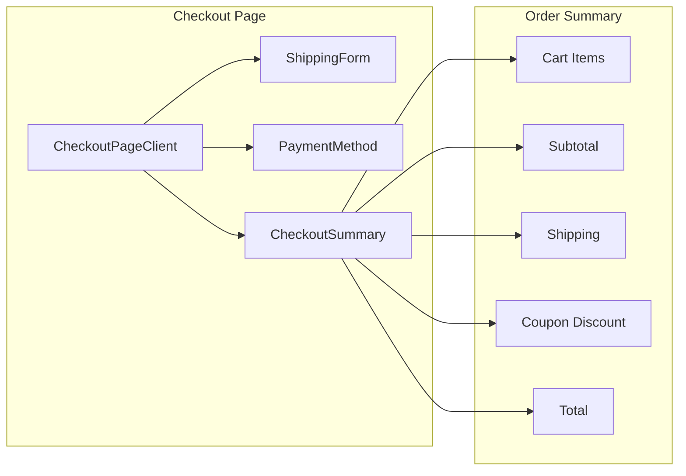

**Key Files:**

- [/carrito](../app/carrito/page.tsx) - Cart page
- [/checkout](../app/checkout/page.tsx) - Checkout page
- [CheckoutPageClient.tsx](../components/cart/checkout/CheckoutPageClient.tsx)
- [CartContext.tsx](../contexts/CartContext.tsx) - Cart state

---

## 5. Seller Dashboard

### Dashboard Overview

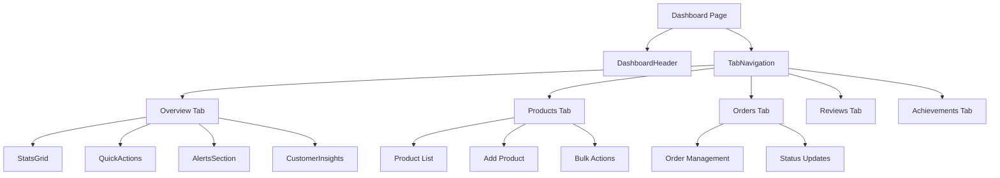

### Product Management Flow

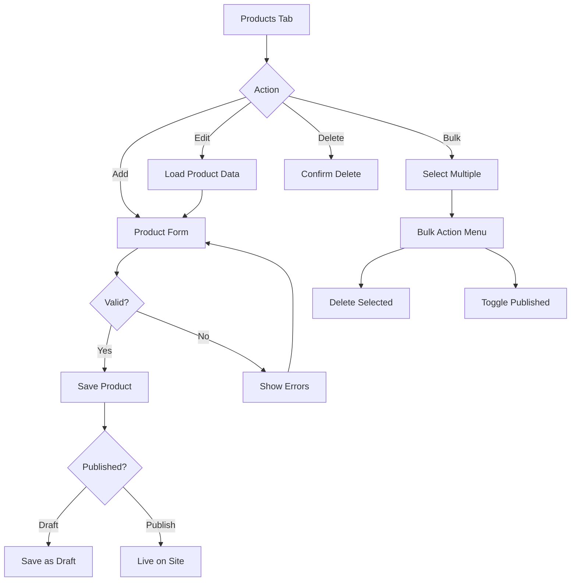

**Key Files:**

- [/dashboard](../app/dashboard/page.tsx) - Dashboard page
- [ProductsTab.tsx](../components/dashboard/tabs/ProductsTab.tsx)
- [OrdersTab.tsx](../components/dashboard/tabs/OrdersTab.tsx)

---

## 6. Admin Workflows

### User Management

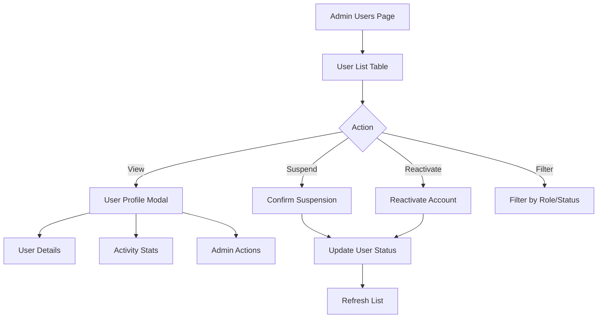

### Verification Workflow

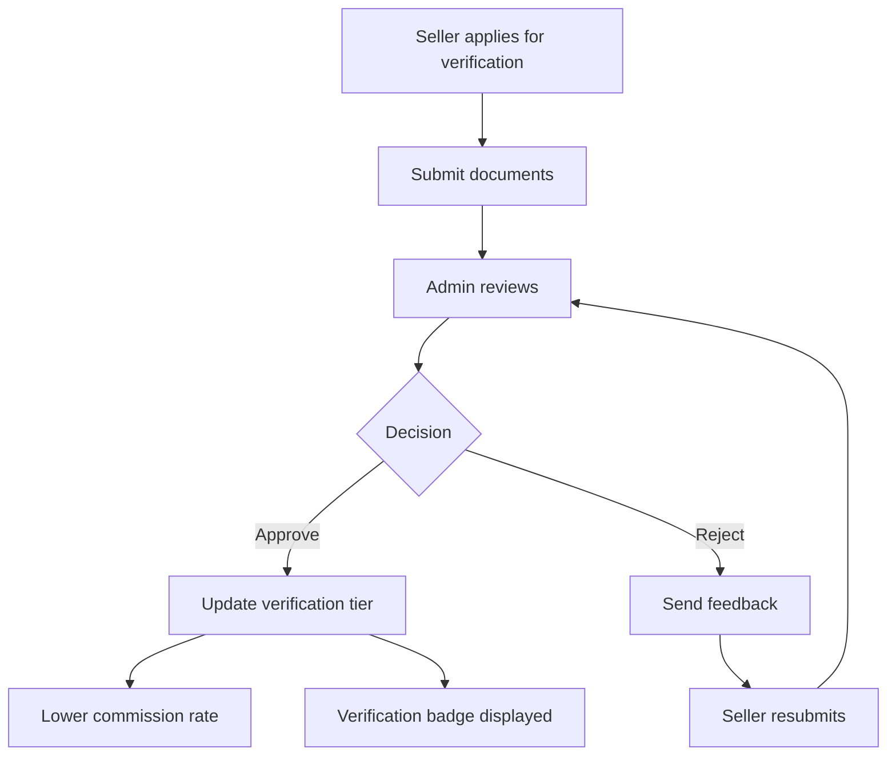

### Verification Tiers

| Tier                 | Commission | Requirements           |
| -------------------- | ---------- | ---------------------- |
| `basic_seller`       | 10%        | Email verified         |
| `verified_artisan`   | 8%         | ID + craft photos      |
| `master_artisan`     | 5%         | Awards, certifications |
| `certified_workshop` | 7%         | Business docs, team    |

**Key Files:**

- [/admin/usuarios](../app/admin/usuarios/page.tsx) - User management
- [UserProfileModal.tsx](../components/admin/UserProfileModal.tsx)
- [verification.ts](../lib/constants/verification.ts) - Tier constants

---

## Flow Diagrams Legend

| Symbol            | Meaning          |
| ----------------- | ---------------- |
| Rectangle         | Action/Process   |
| Diamond           | Decision         |
| Parallelogram     | Input/Output     |
| Cylinder          | Database/Storage |
| Rounded Rectangle | Start/End        |

---

_See also: [Architecture Overview](./architecture/OVERVIEW.md) | [Components](./COMPONENTS.md)_
