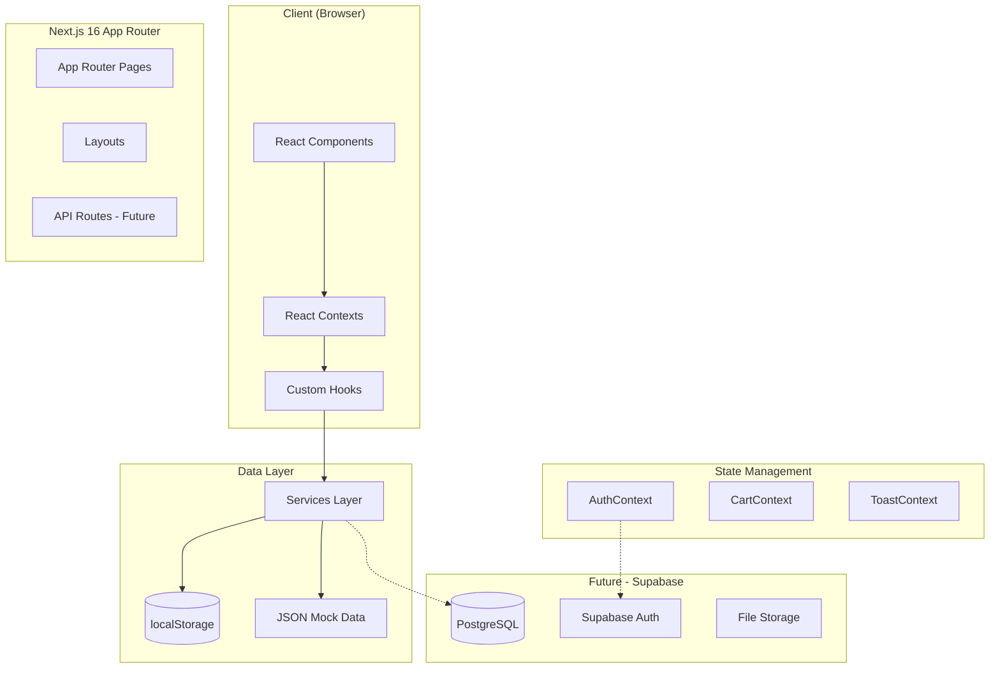
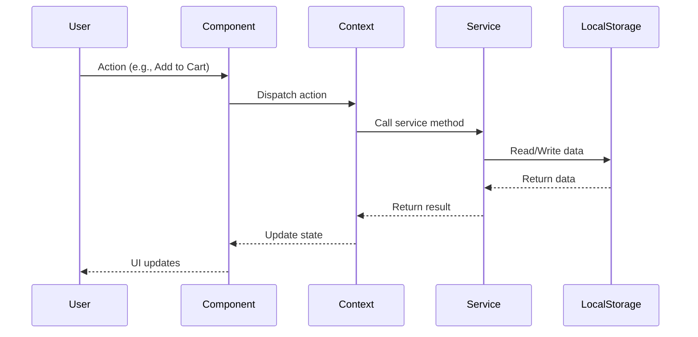
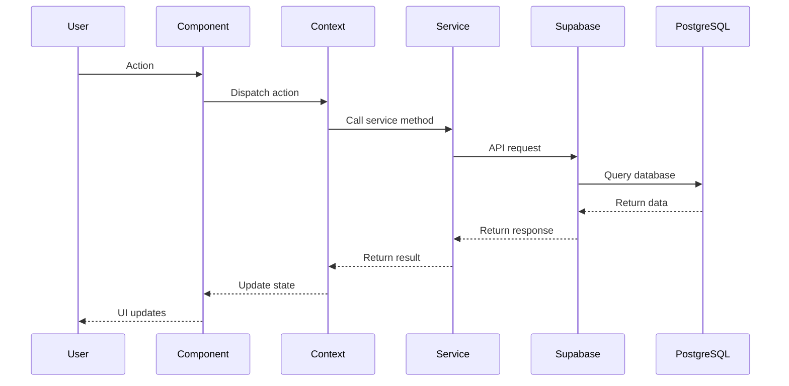

# System Architecture

> High-level architecture overview of Papalote Market.

## Architecture Diagram



## Tech Stack

| Layer      | Technology    | Purpose                  |
| ---------- | ------------- | ------------------------ |
| Framework  | Next.js 16    | App Router, SSR, routing |
| Language   | TypeScript    | Type safety, strict mode |
| Styling    | Tailwind CSS  | Utility-first CSS        |
| Validation | Zod           | Schema validation        |
| Icons      | Lucide React  | Icon library             |
| State      | React Context | Global state management  |
| Storage    | localStorage  | Client-side persistence  |
| Hosting    | Vercel        | Deployment platform      |

## Directory Structure

```
├── app/                    # Next.js App Router pages
│   ├── (auth)/            # Auth-related pages
│   ├── admin/             # Admin panel
│   ├── artesano/[id]/     # Public artisan profiles
│   ├── checkout/          # Checkout flow
│   ├── dashboard/         # Seller dashboard
│   ├── productos/         # Product pages
│   └── tienda/[shopName]/ # Shop pages
│
├── components/            # React components
│   ├── admin/            # Admin-specific components
│   ├── artisan-story/    # Artisan story form sections
│   ├── cart/             # Cart and checkout components
│   ├── charts/           # Data visualization
│   ├── common/           # Shared/reusable components
│   ├── dashboard/        # Seller dashboard components
│   ├── home/             # Homepage sections
│   ├── layout/           # Header, footer, navigation
│   ├── product/          # Product display components
│   ├── profile/          # User profile components
│   └── shop/             # Shop page components
│
├── contexts/             # React Context providers
│   ├── AuthContext.tsx   # Authentication state
│   ├── CartContext.tsx   # Shopping cart state
│   └── ToastContext.tsx  # Toast notifications
│
├── hooks/                # Custom React hooks
│   ├── artisan-story/   # Artisan story hooks
│   ├── common/          # Shared hooks
│   ├── media/           # Media-related hooks
│   └── product/         # Product hooks
│
├── lib/                  # Utilities and data
│   ├── constants/       # Route constants, config
│   ├── data/            # JSON mock data
│   ├── types/           # TypeScript interfaces
│   └── utils/           # Utility functions
│       ├── orders.ts        # Order management
│       ├── coupons.ts       # Coupon validation
│       ├── recently-viewed.ts # Browsing history
│       ├── recommendations.ts # Smart product recommendations
│       └── search.ts        # Search with fuzzy matching
│
├── services/            # Data abstraction layer
│   └── settingsService.ts
│
├── validators/          # Zod validation schemas
│   ├── user.ts         # User/auth schemas
│   └── utils.ts        # Validation utilities
│
└── types/              # Global TypeScript types
    └── product.ts
```

## Data Flow

### Current Implementation (localStorage)



### Future Implementation (Supabase)



## Key Patterns

### 1. AuthPageWrapper Pattern

Centralized authentication wrapper for protected pages:

```tsx
// Usage in any protected page
export default function ProtectedPage() {
  return (
    <AuthPageWrapper requireSeller={false}>
      {(user) => <div>Welcome, {user.name}!</div>}
    </AuthPageWrapper>
  );
}
```

### 2. Service Layer Pattern

Abstraction layer for data operations (enables easy DB migration):

```tsx
// services/settingsService.ts
export const settingsService = {
  getSettings: () => {
    // Currently: localStorage
    // Future: Supabase API call
    return JSON.parse(localStorage.getItem('settings') || '{}');
  },
  saveSettings: (settings) => {
    localStorage.setItem('settings', JSON.stringify(settings));
  },
};
```

### 3. Zod Validation Pattern

Schema-based validation for forms:

```tsx
// validators/user.ts
export const loginSchema = z.object({
  email: z.string().email('Correo electrónico inválido'),
  password: z.string().min(8, 'Mínimo 8 caracteres'),
});

// Usage in component
const result = validate(loginSchema, formData);
if (!result.success) {
  setErrors(result.errors);
}
```

## Component Architecture

### Component Categories

| Category | Location                | Purpose                                      |
| -------- | ----------------------- | -------------------------------------------- |
| Common   | `components/common/`    | Reusable UI primitives (Button, Modal, etc.) |
| Layout   | `components/layout/`    | Header, Footer, Navigation                   |
| Feature  | `components/{feature}/` | Feature-specific components                  |
| Page     | `app/{route}/page.tsx`  | Page components                              |

### Component Composition

```
Page Component
└── AuthPageWrapper (if protected)
    └── Layout Components
        └── Feature Components
            └── Common Components
```

## State Management

### Context Providers

| Context      | Purpose             | Key State                         |
| ------------ | ------------------- | --------------------------------- |
| AuthContext  | User authentication | user, isLoading, login, logout    |
| CartContext  | Shopping cart       | items, addItem, removeItem, total |
| ToastContext | Notifications       | showToast, toasts                 |

### Provider Hierarchy

```tsx
// app/layout.tsx
<ThemeProvider>
  <AuthProvider>
    <CartProvider>
      <ToastProvider>{children}</ToastProvider>
    </CartProvider>
  </AuthProvider>
</ThemeProvider>
```

## Key Features

### Product Recommendations

Smart recommendation system with three strategies:

```tsx
// lib/utils/recommendations.ts
const recommendations = getCombinedRecommendations(product, allProducts, {
  similarLimit: 4, // Same category products
  crossCategoryLimit: 4, // "You might also like"
  recentlyViewedLimit: 4, // Browsing history
});
```

Scoring factors:

- Same category (10 points)
- Same maker (8 points)
- Same state/region (5 points)
- Shared materials (4 points)
- Similar price range (3 points)
- Featured/verified status bonus

### Search with Autocomplete

Enhanced search with fuzzy matching and history:

```tsx
// lib/utils/search.ts
const results = searchProducts(products, query, { limit: 6 });
// Returns: { product, score, matchedFields }[]

// Search history (localStorage)
addToSearchHistory('alebrije');
const history = getSearchHistory(); // Last 10 searches
```

Features:

- Fuzzy matching with Levenshtein distance
- Multi-field search (name, category, maker, state, materials)
- Search history persistence
- Debounced search (300ms)

## Performance Considerations

1. **Image Optimization**: Next.js Image component with lazy loading
2. **Component Memoization**: React.memo for expensive components
3. **Virtual Lists**: VirtualList component for long lists
4. **Code Splitting**: App Router automatic code splitting
5. **Skeleton Loading**: Skeleton components for loading states

## Security Considerations

1. **Input Validation**: Zod schemas for all user inputs
2. **XSS Prevention**: React's built-in escaping
3. **CSRF Protection**: Next.js built-in protections
4. **Auth Guards**: AuthPageWrapper for protected routes

---

_See also: [Folder Structure](../guides/FOLDER-STRUCTURE.md) | [Data Models](../DATA-MODELS.md)_
