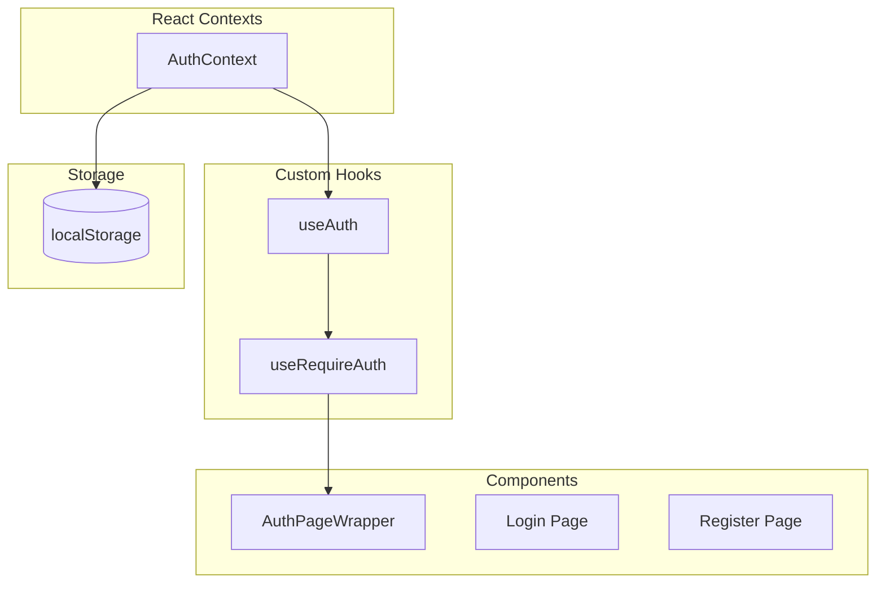

# Authentication System

> User authentication, authorization, and session management.

## Overview

Papalote Market uses a **mock authentication system** with localStorage for the current implementation. The architecture is designed for easy migration to Supabase Auth.

## User Roles

| Role     | Description            | Access Level                                     |
| -------- | ---------------------- | ------------------------------------------------ |
| `buyer`  | Regular shopper        | Browse, purchase, reviews, wishlist              |
| `seller` | Artisan/shop owner     | All buyer features + dashboard, products, orders |
| `admin`  | Platform administrator | Full access + user management, settings          |

## Architecture



## Key Files

| File                                  | Purpose                 |
| ------------------------------------- | ----------------------- |
| `contexts/AuthContext.tsx`            | Auth state provider     |
| `hooks/useRequireAuth.ts`             | Auth requirement hook   |
| `components/auth/AuthPageWrapper.tsx` | Protected route wrapper |
| `validators/user.ts`                  | Auth validation schemas |
| `app/iniciar-sesion/page.tsx`         | Login page              |
| `app/registro/page.tsx`               | Registration page       |

---

## AuthContext

### Provider Setup

```tsx
// app/layout.tsx
import { AuthProvider } from '@/contexts/AuthContext';

export default function RootLayout({ children }) {
  return <AuthProvider>{children}</AuthProvider>;
}
```

### Context API

```typescript
interface AuthContextType {
  // State
  user: User | null;
  isAuthenticated: boolean;
  isLoading: boolean;
  isAdmin: boolean;

  // Methods
  login: (email: string, password: string) => Promise<boolean>;
  register: (data: RegisterInput) => Promise<boolean>;
  logout: () => void;
  updateProfile: (data: UpdateProfileInput) => Promise<void>;
}
```

### Usage

```tsx
import { useAuth } from '@/contexts/AuthContext';

function MyComponent() {
  const { user, isAuthenticated, login, logout } = useAuth();

  if (!isAuthenticated) {
    return <LoginPrompt />;
  }

  return <div>Welcome, {user.name}!</div>;
}
```

---

## Protecting Routes

### AuthPageWrapper Pattern

The recommended way to protect pages:

```tsx
// app/dashboard/page.tsx
import AuthPageWrapper from '@/components/auth/AuthPageWrapper';

export default function DashboardPage() {
  return (
    <AuthPageWrapper requireSeller={true}>
      {(user) => <DashboardContent user={user} />}
    </AuthPageWrapper>
  );
}
```

### Props

| Prop            | Type                        | Default         | Description                         |
| --------------- | --------------------------- | --------------- | ----------------------------------- |
| `children`      | `(user: User) => ReactNode` | -               | Render prop with authenticated user |
| `requireSeller` | `boolean`                   | `false`         | Require seller profile              |
| `loadingText`   | `string`                    | `'Cargando...'` | Loading state text                  |

### How It Works

1. Checks if user is authenticated
2. Shows loading spinner while checking
3. Redirects to login if not authenticated
4. If `requireSeller`, also checks for `makerProfile`
5. Renders children with user object when authenticated

---

## Login Flow

### Validation Schema

```typescript
// validators/user.ts
export const loginSchema = z.object({
  email: z.string().email('Correo electrónico inválido'),
  password: z.string().min(8, 'La contraseña debe tener al menos 8 caracteres'),
  rememberMe: z.boolean().optional(),
});
```

### Mock Users (Development)

| Role   | Email                   | Password      |
| ------ | ----------------------- | ------------- |
| Buyer  | `comprador@ejemplo.com` | `password123` |
| Seller | `sofia@tejidos.com`     | `password123` |
| Seller | `pedro@alebrijes.com`   | `password123` |
| Admin  | `admin@papalote.com`    | `password123` |

### Login Implementation

```tsx
// Simplified login flow
const handleLogin = async (data: LoginInput) => {
  const result = validate(loginSchema, data);

  if (!result.success) {
    setErrors(result.errors);
    return;
  }

  const success = await login(data.email, data.password);

  if (success) {
    router.push('/perfil');
  } else {
    setErrors({ form: 'Credenciales inválidas' });
  }
};
```

---

## Registration Flow

### Validation Schema

```typescript
export const registerSchema = z
  .object({
    name: z.string().min(3, 'El nombre debe tener al menos 3 caracteres'),
    email: z.string().email('Correo electrónico inválido'),
    password: z
      .string()
      .min(8, 'La contraseña debe tener al menos 8 caracteres')
      .regex(/[A-Z]/, 'Debe contener al menos una mayúscula')
      .regex(/[a-z]/, 'Debe contener al menos una minúscula')
      .regex(/[0-9]/, 'Debe contener al menos un número'),
    confirmPassword: z.string(),
    acceptTerms: z.boolean().refine((val) => val === true, {
      message: 'Debes aceptar los términos y condiciones',
    }),
  })
  .refine((data) => data.password === data.confirmPassword, {
    message: 'Las contraseñas no coinciden',
    path: ['confirmPassword'],
  });
```

### Registration Steps

1. User fills registration form
2. Form validates with Zod schema
3. `register()` creates user in localStorage
4. User auto-logged in
5. Redirect to profile page
6. Optional: Show seller setup prompt

---

## Seller Activation

### Becoming a Seller

Buyers can become sellers by activating a shop:

```tsx
// app/perfil/page.tsx
const handleActivateShop = () => {
  setShowSellerSetup(true);
};

// Shows SellerSetupForm modal
{
  showSellerSetup && (
    <SellerSetupForm onClose={() => setShowSellerSetup(false)} onSave={handleSaveSellerProfile} />
  );
}
```

### Seller Profile Data

```typescript
interface MakerProfile {
  shopName: string; // Min 3 chars
  location: string; // City, State
  description: string; // 20-300 chars
  verified?: boolean;
  verificationLevel?: VerificationLevel;
}
```

---

## Session Management

### Current Implementation (localStorage)

```typescript
// On login
localStorage.setItem('user', JSON.stringify(user));

// On logout
localStorage.removeItem('user');

// On app load
const storedUser = localStorage.getItem('user');
if (storedUser) {
  setUser(JSON.parse(storedUser));
}
```

### Hydration Handling

To prevent hydration mismatches:

```tsx
const [mounted, setMounted] = useState(false);

useEffect(() => {
  setMounted(true);
}, []);

if (!mounted) {
  return <LoadingSpinner />;
}
```

---

## Future: Supabase Migration

### Planned Changes

```typescript
// Future AuthContext with Supabase
import { createClient } from '@supabase/supabase-js';

const supabase = createClient(url, key);

const login = async (email: string, password: string) => {
  const { data, error } = await supabase.auth.signInWithPassword({
    email,
    password,
  });
  return !error;
};

const register = async (data: RegisterInput) => {
  const { error } = await supabase.auth.signUp({
    email: data.email,
    password: data.password,
    options: {
      data: { name: data.name },
    },
  });
  return !error;
};
```

### Migration Checklist

- [ ] Set up Supabase project
- [ ] Configure auth providers
- [ ] Update AuthContext to use Supabase client
- [ ] Migrate user data to Supabase
- [ ] Update password reset flow
- [ ] Add email verification
- [ ] Implement OAuth providers (optional)

---

## Security Considerations

### Current Limitations

- Mock auth is **not production-ready**
- Passwords stored in plain text (mock only)
- No rate limiting
- No email verification

### Best Practices Followed

- Zod validation on all inputs
- Password strength requirements
- CSRF protection via Next.js
- XSS prevention via React

---

## Related Documentation

- [User Flows](../FLOWS.md#1-authentication-flow)
- [Data Models - User Types](../DATA-MODELS.md#user--authentication)
- [Components - AuthPageWrapper](../COMPONENTS.md#authpagewrapper)
