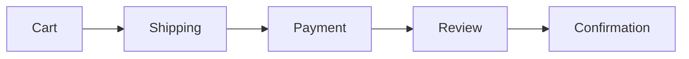

# Cart & Checkout

> Shopping cart management and checkout flow implementation.

## Overview

The cart system uses React Context for state management with localStorage persistence. The checkout flow is a multi-step process handling shipping, payment, and order confirmation.

## Architecture

```mermaid
flowchart TD
    subgraph CartSystem["Cart System"]
        CartCtx[CartContext]
        CartHook[useCart Hook]
    end

    subgraph Pages["Pages"]
        CartPage[/carrito]
        CheckoutPage[/checkout]
        ConfirmPage[Order Confirmation]
    end

    subgraph Components["Components"]
        CartItemCard
        CartSummary
        ShippingForm
        PaymentMethod
        CheckoutSummary
    end

    subgraph Storage["Persistence"]
        LS[(localStorage)]
    end

    CartCtx --> CartHook
    CartHook --> CartPage
    CartHook --> CheckoutPage
    CartPage --> CartItemCard
    CartPage --> CartSummary
    CheckoutPage --> ShippingForm
    CheckoutPage --> PaymentMethod
    CheckoutPage --> CheckoutSummary
    CheckoutPage --> ConfirmPage
    CartCtx --> LS
```

## Key Files

| File                               | Purpose               |
| ---------------------------------- | --------------------- |
| `contexts/CartContext.tsx`         | Cart state management |
| `app/carrito/page.tsx`             | Cart page             |
| `app/checkout/page.tsx`            | Checkout page         |
| `components/cart/CartItemCard.tsx` | Cart item display     |
| `components/cart/CartSummary.tsx`  | Order summary         |
| `components/cart/checkout/`        | Checkout components   |
| `lib/types/checkout.ts`            | Checkout types        |

---

## CartContext

### Provider Setup

```tsx
// app/layout.tsx
import { CartProvider } from '@/contexts/CartContext';

export default function RootLayout({ children }) {
  return (
    <AuthProvider>
      <CartProvider>{children}</CartProvider>
    </AuthProvider>
  );
}
```

### Context API

```typescript
interface CartContextType {
  // State
  items: CartItem[];
  itemCount: number;
  subtotal: number;
  shipping: number;
  tax: number;
  discount: number;
  total: number;

  // Methods
  addItem: (product: Product, quantity?: number, size?: string) => void;
  removeItem: (itemId: string, size?: string) => void;
  updateQuantity: (itemId: string, quantity: number, size?: string) => void;
  clearCart: () => void;
  applyCoupon: (code: string) => Promise<CouponResult>;
  removeCoupon: () => void;

  // Coupon state
  appliedCoupon: AppliedCoupon | null;
}
```

### Usage

```tsx
import { useCart } from '@/contexts/CartContext';

function ProductPage({ product }) {
  const { addItem, itemCount } = useCart();

  const handleAddToCart = () => {
    addItem(product, 1, selectedSize);
    showToast('Producto agregado al carrito');
  };

  return <button onClick={handleAddToCart}>Add to Cart ({itemCount})</button>;
}
```

---

## Cart Item Management

### Adding Items

```tsx
// With size selection
addItem(product, quantity, 'M');

// Without size (one-size products)
addItem(product, 1);
```

### CartItem Structure

```typescript
interface CartItem extends Product {
  quantity: number;
  addedAt: string;
  selectedSize?: string;
}
```

### Size Handling

Items with different sizes are treated as separate cart entries:

```typescript
// These are TWO separate cart items
addItem(tshirt, 1, 'S');
addItem(tshirt, 1, 'L');
```

### Quantity Updates

```tsx
// Increase quantity
updateQuantity(itemId, currentQty + 1, size);

// Decrease quantity
updateQuantity(itemId, currentQty - 1, size);

// Remove if quantity reaches 0
if (newQuantity <= 0) {
  removeItem(itemId, size);
}
```

---

## Cart Page

### Components Structure

```
CartPageClient
├── EmptyCart (if no items)
└── Cart Content
    ├── CartItemCard (for each item)
    │   ├── Product Image
    │   ├── Product Info
    │   ├── Size Badge
    │   ├── Quantity Controls
    │   └── Remove Button
    ├── CartSummary
    │   ├── Subtotal
    │   ├── Shipping Estimate
    │   ├── Coupon Input
    │   └── Total
    └── Checkout Button
```

### CartItemCard Props

```typescript
interface CartItemCardProps {
  item: CartItem;
  onUpdateQuantity: (quantity: number) => void;
  onRemove: () => void;
}
```

### CartSummary Props

```typescript
interface CartSummaryProps {
  items: CartItem[];
  showCouponInput?: boolean;
  onApplyCoupon?: (code: string) => Promise<void>;
  onProceedToCheckout?: () => void;
}
```

---

## Coupon System

### Applying Coupons

```tsx
const handleApplyCoupon = async (code: string) => {
  const result = await applyCoupon(code);

  if (result.valid) {
    showToast(`Cupón aplicado: ${result.discount}% descuento`);
  } else {
    showToast(result.error, 'error');
  }
};
```

### Coupon Types

```typescript
interface AppliedCoupon {
  code: string;
  type: 'percentage' | 'fixed';
  value: number;
  minPurchase?: number;
  maxDiscount?: number;
}
```

### Available Test Coupons

| Code           | Type       | Value | Min Purchase |
| -------------- | ---------- | ----- | ------------ |
| `BIENVENIDO10` | Percentage | 10%   | $500         |
| `ARTESANO20`   | Percentage | 20%   | $1,000       |
| `ENVIOGRATIS`  | Shipping   | Free  | $800         |

---

## Checkout Flow

### Checkout Steps



### CheckoutState

```typescript
interface CheckoutState {
  currentStep: 'shipping' | 'payment' | 'review';
  shippingAddress: ShippingAddress | null;
  paymentMethod: PaymentMethod | null;
  isProcessing: boolean;
  errors: Record<string, string>;
}
```

### Step Navigation

```tsx
const [step, setStep] = useState<CheckoutStep>('shipping');

const handleShippingComplete = (address: ShippingAddress) => {
  setShippingAddress(address);
  setStep('payment');
};

const handlePaymentComplete = (method: PaymentMethod) => {
  setPaymentMethod(method);
  setStep('review');
};

const handlePlaceOrder = async () => {
  setIsProcessing(true);
  const order = await createOrder({
    items: cartItems,
    shippingAddress,
    paymentMethod,
  });
  clearCart();
  router.push(`/pedidos/${order.id}/confirmacion`);
};
```

---

## Shipping Form

### Fields

```typescript
interface ShippingAddress {
  fullName: string;
  street: string;
  city: string;
  state: string;
  postalCode: string;
  country: string; // Default: 'México'
  phone: string;
  isDefault?: boolean;
}
```

### Validation

```typescript
const shippingSchema = z.object({
  fullName: z.string().min(3, 'Nombre requerido'),
  street: z.string().min(5, 'Dirección requerida'),
  city: z.string().min(2, 'Ciudad requerida'),
  state: z.string().min(2, 'Estado requerido'),
  postalCode: z.string().regex(/^\d{5}$/, 'Código postal inválido'),
  phone: z.string().regex(/^\+?52?\s?[\d\s]{10,14}$/, 'Teléfono inválido'),
});
```

### Saved Addresses

```tsx
// Load saved addresses
const savedAddresses = user?.addresses || [];

// Select saved address
const handleSelectAddress = (address: ShippingAddress) => {
  setShippingAddress(address);
  setStep('payment');
};
```

---

## Payment Methods

### Supported Methods

| Method   | Type       | Description          |
| -------- | ---------- | -------------------- |
| Card     | `card`     | Credit/Debit card    |
| PayPal   | `paypal`   | PayPal checkout      |
| OXXO     | `oxxo`     | Cash payment at OXXO |
| Transfer | `transfer` | Bank transfer        |

### PaymentMethod Interface

```typescript
interface PaymentMethod {
  id: string;
  type: 'card' | 'paypal' | 'oxxo' | 'transfer';
  last4?: string; // For cards
  brand?: string; // visa, mastercard, amex
  expiryMonth?: number;
  expiryYear?: number;
  isDefault?: boolean;
}
```

### Card Input

```tsx
// Simplified card form
<CardInput
  onComplete={(cardData) => {
    setPaymentMethod({
      type: 'card',
      last4: cardData.number.slice(-4),
      brand: detectCardBrand(cardData.number),
      expiryMonth: cardData.expMonth,
      expiryYear: cardData.expYear,
    });
  }}
/>
```

---

## Order Summary

### CheckoutSummary Component

```tsx
<CheckoutSummary
  items={cartItems}
  shippingAddress={shippingAddress}
  paymentMethod={paymentMethod}
  appliedCoupon={appliedCoupon}
  onPlaceOrder={handlePlaceOrder}
  isProcessing={isProcessing}
/>
```

### Order Totals Calculation

```typescript
const calculateTotals = (items: CartItem[], coupon?: AppliedCoupon) => {
  const subtotal = items.reduce((sum, item) => sum + item.price * item.quantity, 0);

  const shipping = subtotal >= 800 ? 0 : 99; // Free shipping over $800

  let discount = 0;
  if (coupon) {
    if (coupon.type === 'percentage') {
      discount = subtotal * (coupon.value / 100);
      if (coupon.maxDiscount) {
        discount = Math.min(discount, coupon.maxDiscount);
      }
    } else {
      discount = coupon.value;
    }
  }

  const total = subtotal + shipping - discount;

  return { subtotal, shipping, discount, total };
};
```

---

## Order Confirmation

### CompleteOrder Structure

```typescript
interface CompleteOrder {
  id: string;
  orderNumber: string;
  items: OrderItem[];
  summary: CartSummary;
  shippingAddress: ShippingAddress;
  paymentMethod: PaymentMethod;
  status: 'pending' | 'confirmed';
  paymentStatus: 'pending' | 'paid';
  createdAt: string;
  estimatedDelivery: string;
  giftWrap?: boolean;
  giftMessage?: string;
}
```

### Confirmation Page

```tsx
// app/pedidos/[id]/confirmacion/page.tsx
export default function OrderConfirmationPage({ params }) {
  const order = getOrder(params.id);

  return (
    <OrderConfirmation
      order={order}
      onContinueShopping={() => router.push('/productos')}
      onViewOrders={() => router.push('/pedidos')}
    />
  );
}
```

---

## Gift Options

### Gift Wrap

```tsx
<Checkbox label="Envolver para regalo (+$50)" checked={giftWrap} onChange={setGiftWrap} />;

{
  giftWrap && (
    <Textarea
      label="Mensaje de regalo"
      value={giftMessage}
      onChange={setGiftMessage}
      maxLength={200}
      placeholder="Escribe un mensaje personalizado..."
    />
  );
}
```

### Gift Pricing

```typescript
const giftWrapFee = giftWrap ? 50 : 0;
const total = subtotal + shipping - discount + giftWrapFee;
```

---

## LocalStorage Persistence

### Cart Persistence

```typescript
// Save cart on changes
useEffect(() => {
  localStorage.setItem('cart', JSON.stringify(items));
}, [items]);

// Load cart on mount
useEffect(() => {
  const savedCart = localStorage.getItem('cart');
  if (savedCart) {
    setItems(JSON.parse(savedCart));
  }
}, []);
```

### Hydration Handling

```tsx
const [mounted, setMounted] = useState(false);

useEffect(() => {
  setMounted(true);
}, []);

// Avoid hydration mismatch
if (!mounted) {
  return <CartSkeleton />;
}
```

---

## Error Handling

### Common Errors

| Error             | Cause                   | Solution                       |
| ----------------- | ----------------------- | ------------------------------ |
| Item out of stock | Stock depleted          | Show message, remove from cart |
| Invalid coupon    | Expired/invalid code    | Show error message             |
| Payment failed    | Card declined           | Retry with different method    |
| Address invalid   | Missing required fields | Highlight validation errors    |

### Error Display

```tsx
{
  errors.form && (
    <Alert variant="error" title="Error">
      {errors.form}
    </Alert>
  );
}
```

---

## Related Documentation

- [User Flows - Checkout Flow](../FLOWS.md#4-checkout-flow)
- [Data Models - Cart Types](../DATA-MODELS.md#cart--shopping)
- [Data Models - Order Types](../DATA-MODELS.md#order-types)
- [Components - Cart Components](../COMPONENTS.md#cart--checkout)
