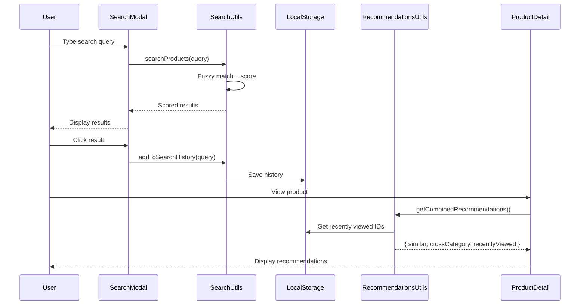

# Search & Recommendations

> Intelligent search and product recommendation system for Papalote Market.

## Overview

The search and recommendations system provides:

- **Enhanced Search**: Fuzzy matching with typo tolerance
- **Search History**: Persistent browsing history
- **Product Recommendations**: Smart suggestions based on multiple factors
- **Cross-Category Discovery**: Help users discover related products

---

## Search System

### Components

| Component        | File                            | Purpose                             |
| ---------------- | ------------------------------- | ----------------------------------- |
| SearchModal      | `components/ui/SearchModal.tsx` | Global search UI with autocomplete  |
| Search utilities | `lib/utils/search.ts`           | Search logic and history management |

### Features

#### Fuzzy Matching

Uses Levenshtein distance for typo tolerance:

```typescript
// "alebije" matches "Alebrije" with score adjustment
const results = searchProducts(products, 'alebije');
```

#### Multi-Field Search

Searches across multiple product fields with weighted scoring:

| Field       | Weight | Example                   |
| ----------- | ------ | ------------------------- |
| Name        | 10     | "Alebrije Colorido"       |
| Category    | 8      | "Artesanías"              |
| Maker       | 6      | "Artesano Pedro"          |
| State       | 5      | "Oaxaca"                  |
| Materials   | 4      | "Madera", "Pintura"       |
| Tags        | 3      | "tradicional", "colorido" |
| Description | 2      | Product description text  |

#### Search History

Persists last 10 searches in localStorage:

```typescript
import {
  addToSearchHistory,
  getSearchHistory,
  removeFromSearchHistory,
  clearSearchHistory,
} from '@/lib/utils/search';

// Add a search
addToSearchHistory('alebrije');

// Get history
const history = getSearchHistory();
// [{ query: 'alebrije', timestamp: '2026-01-26T...' }, ...]

// Remove specific item
removeFromSearchHistory('alebrije');

// Clear all
clearSearchHistory();
```

### Usage

```tsx
import { searchProducts, getSearchSuggestions } from '@/lib/utils/search';

// Full search with scoring
const results = searchProducts(products, 'alebrije', {
  limit: 6, // Max results
  minScore: 0.2, // Minimum relevance score
});

results.forEach(({ product, score, matchedFields }) => {
  console.log(`${product.name}: ${score} (matched: ${matchedFields.join(', ')})`);
});

// Get suggestions for autocomplete
const suggestions = getSearchSuggestions(products, 'ale', 5);
// ['Alebrije Colorido', 'Alebrije Pequeño', ...]
```

### SearchModal Component

The global search modal provides:

- **Debounced Input**: 300ms delay to reduce API calls
- **Keyboard Navigation**: Arrow keys, Enter, Escape
- **History Display**: Recent searches with remove option
- **Category Suggestions**: Quick category links
- **Product Preview**: Thumbnail, price, category for each result

```tsx
<SearchModal
  isOpen={isSearchOpen}
  onClose={() => setIsSearchOpen(false)}
  products={allProducts}
  categories={categories}
/>
```

---

## Recommendation System

### Components

| Component                 | File                                            | Purpose                              |
| ------------------------- | ----------------------------------------------- | ------------------------------------ |
| ProductRecommendations    | `components/product/ProductRecommendations.tsx` | Displays all recommendation sections |
| Recommendations utilities | `lib/utils/recommendations.ts`                  | Recommendation algorithms            |

### Recommendation Types

#### 1. Similar Products

Products in the same category with similar attributes:

```typescript
const similar = getRecommendedProducts(currentProduct, allProducts, 4);
```

**Scoring Factors:**

| Factor          | Points | Description                     |
| --------------- | ------ | ------------------------------- |
| Same category   | 10     | Exact category match            |
| Same maker      | 8      | From the same artisan           |
| Same state      | 5      | From the same region            |
| Shared material | 4      | At least one material in common |
| Similar price   | 3      | Within 30% of price range       |
| Featured        | 2      | Product is featured             |
| Verified        | 1      | Seller is verified              |

#### 2. Cross-Category Recommendations

Products from different categories that share attributes ("También te puede gustar"):

```typescript
const crossCategory = getCrossCategoryRecommendations(currentProduct, allProducts, 4);
```

Prioritizes:

- Same maker in different category
- Same region
- Shared materials
- Similar price range

#### 3. Recently Viewed

Products the user has previously viewed:

```typescript
const recentlyViewed = getRecentlyViewedProducts(currentProductId, allProducts, 4);
```

### Combined Recommendations

Get all recommendation types in one call:

```typescript
import { getCombinedRecommendations } from '@/lib/utils/recommendations';

const recommendations = getCombinedRecommendations(product, allProducts, {
  similarLimit: 4,
  crossCategoryLimit: 4,
  recentlyViewedLimit: 4,
});

// Returns:
// {
//   similar: Product[],
//   crossCategory: Product[],
//   recentlyViewed: Product[]
// }
```

### ProductRecommendations Component

Displays all recommendation sections:

```tsx
<ProductRecommendations
  currentProduct={product}
  allProducts={allProducts}
  showCrossCategory={true} // Default: true
  showRecentlyViewed={true} // Default: true
/>
```

**Features:**

- Responsive grid layout
- Section headers with "Ver más" links
- Hides empty sections automatically
- Uses ProductCard for consistent display

---

## Data Flow



---

## Testing

### Search Tests

Located in `lib/utils/__tests__/search.test.ts`:

```bash
npm test -- search.test.ts
```

Test coverage:

- Search history CRUD operations
- Fuzzy matching accuracy
- Multi-field search
- Score calculation
- Suggestion generation

### Recommendations Tests

Located in `lib/utils/__tests__/recommendations.test.ts`:

```bash
npm test -- recommendations.test.ts
```

Test coverage:

- Similar product scoring
- Cross-category filtering
- Recently viewed retrieval
- Combined recommendations
- Limit parameter respect

### Component Tests

Located in `components/product/__tests__/ProductRecommendations.test.tsx`:

```bash
npm test -- ProductRecommendations.test.ts
```

---

## Configuration

### Score Weights (Recommendations)

Defined in `lib/utils/recommendations.ts`:

```typescript
const SCORE_WEIGHTS = {
  sameCategory: 10,
  sameMaker: 8,
  sameState: 5,
  sameMaterial: 4,
  similarPrice: 3,
  featured: 2,
  verified: 1,
};
```

### Search Field Weights

Defined in `lib/utils/search.ts`:

```typescript
const FIELD_WEIGHTS = {
  name: 10,
  category: 8,
  maker: 6,
  state: 5,
  materials: 4,
  tags: 3,
  description: 2,
};
```

### History Limit

Maximum 10 search history items stored:

```typescript
const MAX_HISTORY_ITEMS = 10;
```

---

## Future Improvements

1. **Server-Side Search**: Move to Supabase full-text search
2. **Personalized Recommendations**: Based on user purchase history
3. **Collaborative Filtering**: "Customers who bought X also bought Y"
4. **A/B Testing**: Test different recommendation algorithms
5. **Analytics Integration**: Track recommendation click-through rates

---

## Related Documentation

- [Architecture Overview](../architecture/OVERVIEW.md)
- [Folder Structure](../guides/FOLDER-STRUCTURE.md)
- [Testing Guide](../guides/TESTING.md)

---

_Last updated: January 26, 2026_
