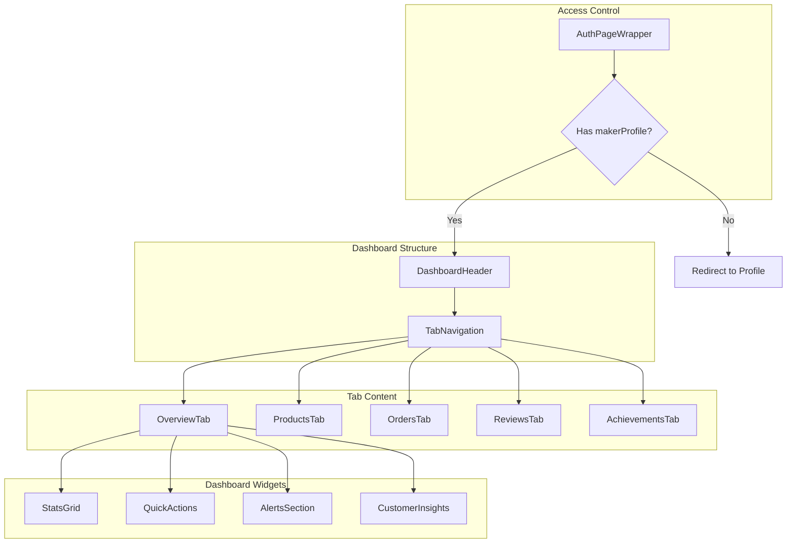
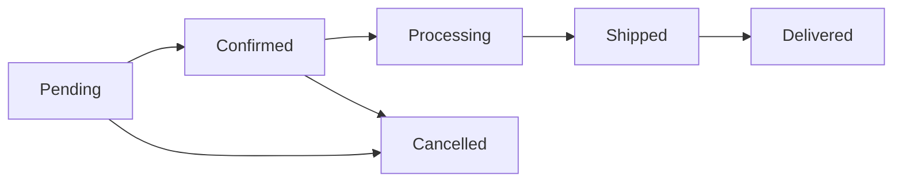

# Seller Dashboard

> Seller tools for managing products, orders, and analytics.

## Overview

The seller dashboard provides artisans with tools to manage their shop, track sales, handle orders, and view analytics. Access requires authentication with a seller profile.

## Architecture



## Key Files

| File                                       | Purpose                |
| ------------------------------------------ | ---------------------- |
| `app/dashboard/page.tsx`                   | Dashboard page         |
| `components/dashboard/DashboardHeader.tsx` | Header with shop info  |
| `components/dashboard/TabNavigation.tsx`   | Tab switcher           |
| `components/dashboard/StatsGrid.tsx`       | Metrics display        |
| `components/dashboard/tabs/`               | Tab content components |
| `lib/types/seller-types.ts`                | Seller data types      |

---

## Dashboard Access

### Protected Route

```tsx
// app/dashboard/page.tsx
export default function DashboardPage() {
  return (
    <AuthPageWrapper requireSeller={true}>
      {(user) => <DashboardContent user={user} />}
    </AuthPageWrapper>
  );
}
```

### Seller Check

```typescript
// useRequireAuth with requireSeller
const { user, isLoading } = useRequireAuth({ requireSeller: true });

// Redirects if:
// 1. Not authenticated → /iniciar-sesion
// 2. No makerProfile → /perfil (to set up shop)
```

---

## Dashboard Header

### DashboardHeader Component

```tsx
<DashboardHeader
  shopName={user.makerProfile.shopName}
  verificationLevel={user.makerProfile.verificationLevel}
  verified={user.makerProfile.verified}
  avatarUrl={user.avatar}
/>
```

### Header Features

- Shop name and avatar
- Verification badge (if verified)
- Quick stats summary
- Edit shop button
- View public shop link

---

## Tab Navigation

### Available Tabs

| Tab          | Icon          | Description                  |
| ------------ | ------------- | ---------------------------- |
| Overview     | `BarChart3`   | Stats, charts, quick actions |
| Products     | `Package`     | Product management           |
| Orders       | `ShoppingBag` | Order management             |
| Reviews      | `Star`        | Review responses             |
| Achievements | `Trophy`      | Seller achievements          |

### TabNavigation Component

```tsx
<TabNavigation
  activeTab={activeTab}
  onTabChange={setActiveTab}
  tabs={[
    { id: 'overview', label: 'Resumen', icon: BarChart3 },
    { id: 'products', label: 'Productos', icon: Package, badge: '12' },
    { id: 'orders', label: 'Pedidos', icon: ShoppingBag, badge: '3' },
    { id: 'reviews', label: 'Reseñas', icon: Star },
    { id: 'achievements', label: 'Logros', icon: Trophy },
  ]}
/>
```

---

## Overview Tab

### Components Structure

```
OverviewTab
├── StatsGrid
│   ├── Revenue Today
│   ├── Orders This Week
│   ├── Products Listed
│   └── Average Rating
├── QuickActions
│   ├── Add Product
│   ├── View Messages
│   ├── Check Analytics
│   └── Update Story
├── AlertsSection
│   ├── Low Stock Alerts
│   ├── Pending Orders
│   └── Unread Messages
└── CustomerInsights
    ├── Top Customers
    ├── Purchase Patterns
    └── Geographic Data
```

### StatsGrid

```tsx
<StatsGrid
  stats={[
    {
      label: 'Ventas Hoy',
      value: '$2,450',
      change: 12,
      icon: DollarSign,
      color: 'green',
    },
    {
      label: 'Pedidos Semana',
      value: '23',
      change: -5,
      icon: ShoppingBag,
      color: 'blue',
    },
    // ...
  ]}
/>
```

### QuickActions

```tsx
<QuickActions
  actions={[
    {
      label: 'Agregar Producto',
      icon: Plus,
      href: '/dashboard/productos/nuevo',
      color: 'purple',
    },
    {
      label: 'Ver Mensajes',
      icon: MessageSquare,
      href: '/dashboard/mensajes',
      badge: 5,
    },
    // ...
  ]}
/>
```

### AlertsSection

```tsx
<AlertsSection
  alerts={[
    {
      type: 'warning',
      title: 'Stock Bajo',
      message: '3 productos con stock menor a 5 unidades',
      action: { label: 'Ver productos', href: '/dashboard/productos?filter=low-stock' },
    },
    {
      type: 'info',
      title: 'Pedidos Pendientes',
      message: '2 pedidos esperando envío',
      action: { label: 'Ver pedidos', href: '/dashboard/pedidos?status=pending' },
    },
  ]}
/>
```

---

## Products Tab

### Features

- Product listing with search/filter
- Add new product
- Edit existing products
- Bulk actions (delete, publish/unpublish)
- Draft management
- Stock tracking

### Product Table

```tsx
<ProductsTab
  products={sellerProducts}
  onAddProduct={handleAddProduct}
  onEditProduct={handleEditProduct}
  onDeleteProduct={handleDeleteProduct}
  onTogglePublished={handleTogglePublished}
/>
```

### Product Actions

| Action            | Description                    |
| ----------------- | ------------------------------ |
| Add               | Open product form modal        |
| Edit              | Load product data into form    |
| Quick Edit        | Inline edit name, price, stock |
| Delete            | Confirm and remove product     |
| Publish/Unpublish | Toggle visibility              |
| Duplicate         | Create copy of product         |

### Quick Edit Modal

The Quick Edit feature allows sellers to update essential product details without leaving the dashboard:

```tsx
import QuickEditModal from '@/components/dashboard/QuickEditModal';

<QuickEditModal
  product={selectedProduct}
  isOpen={isQuickEditOpen}
  onClose={() => setIsQuickEditOpen(false)}
  onSave={async (productId, data) => {
    await updateProductQuick(productId, data, user.email);
  }}
/>;
```

**Editable Fields:**

- Product name
- Price (MXN)
- Stock quantity

**Features:**

- Form validation with Spanish error messages
- Save button disabled until changes detected
- Loading state during save
- Escape key to close
- Dark mode support

### Bulk Actions

```tsx
// Select multiple products
const [selectedIds, setSelectedIds] = useState<string[]>([]);

// Bulk operations
const handleBulkDelete = () => {
  selectedIds.forEach((id) => deleteProduct(id));
  setSelectedIds([]);
};

const handleBulkPublish = (publish: boolean) => {
  selectedIds.forEach((id) => updateProduct(id, { status: publish ? 'published' : 'draft' }));
};
```

### Product Form

```typescript
interface ProductFormData {
  // Basic
  name: string;
  description: string;
  price: number;
  category: string;
  subcategory?: string;
  state: string;

  // Media
  images: string[];
  videos?: string[];

  // Inventory
  stock: number;
  status: 'draft' | 'published';

  // Details
  materials?: string[];
  dimensions?: ProductDimensions;
  careInstructions?: string;

  // Sizing
  sizeType?: 'clothing' | 'shoes' | 'rings' | 'one-size';
  availableSizes?: string[];

  // Advanced
  customizable?: boolean;
  productionTime?: string;
  story?: string;
}
```

---

## Orders Tab

### Order States



### OrdersTab Component

```tsx
<OrdersTab
  orders={sellerOrders}
  onUpdateStatus={handleUpdateStatus}
  onAddTracking={handleAddTracking}
  onContactBuyer={handleContactBuyer}
/>
```

### Order Card

```tsx
<SellerOrderCard
  order={order}
  actions={
    <>
      <Button onClick={() => updateStatus(order.id, 'shipped')}>Marcar como Enviado</Button>
      <Button variant="outline" onClick={() => openTrackingModal(order)}>
        Agregar Guía
      </Button>
    </>
  }
/>
```

### Order Filters

| Filter | Options                                     |
| ------ | ------------------------------------------- |
| Status | All, Pending, Confirmed, Shipped, Delivered |
| Date   | Today, This Week, This Month, Custom        |
| Urgent | Show urgent orders first                    |

---

## Reviews Tab

### ReviewsTab Features

- View all product reviews
- Respond to reviews
- Filter by rating
- Sort by date/rating

### Review Response

```tsx
<ReviewCard
  review={review}
  onRespond={(response) => {
    submitResponse(review.id, response);
    showToast('Respuesta publicada');
  }}
/>
```

### Review Stats

```tsx
<ReviewStats
  averageRating={4.7}
  totalReviews={156}
  breakdown={[
    { stars: 5, count: 120 },
    { stars: 4, count: 25 },
    { stars: 3, count: 8 },
    { stars: 2, count: 2 },
    { stars: 1, count: 1 },
  ]}
/>
```

---

## Achievements Tab

### Achievement System

Sellers can earn achievements based on performance:

| Achievement        | Requirement                  |
| ------------------ | ---------------------------- |
| First Sale         | Complete 1 sale              |
| Rising Star        | 10 sales in first month      |
| Top Rated          | 4.8+ rating with 20+ reviews |
| Best Seller        | 100+ sales                   |
| Quick Responder    | < 1 hour avg response time   |
| Community Favorite | 50+ repeat customers         |

### AchievementsTab

```tsx
<AchievementsTab
  earned={earnedAchievements}
  inProgress={inProgressAchievements}
  locked={lockedAchievements}
/>
```

### Achievement Card

```tsx
<AchievementCard
  achievement={{
    id: 'top-rated',
    name: 'Mejor Valorado',
    description: 'Mantén una calificación de 4.8+ con 20+ reseñas',
    icon: Star,
    progress: 85,
    earned: false,
  }}
/>
```

---

## Analytics

### AnalyticsDashboard

```tsx
<AnalyticsDashboard
  period="month"
  data={{
    revenue: revenueData,
    orders: orderData,
    visitors: visitorData,
    topProducts: topProductsData,
  }}
/>
```

### Available Metrics

| Metric          | Description                |
| --------------- | -------------------------- |
| Revenue         | Daily/weekly/monthly sales |
| Orders          | Order count and trends     |
| Views           | Product page views         |
| Conversion      | Views to purchases ratio   |
| Top Products    | Best selling items         |
| Traffic Sources | Where visitors come from   |

### De Visita a Compra (Conversion Funnel)

Visual funnel showing customer journey stages with conversion rates:

```tsx
import ConversionFunnel from '@/components/charts/ConversionFunnel';
import { Eye, ShoppingCart, CreditCard, Package } from 'lucide-react';

<ConversionFunnel
  steps={[
    { label: 'Visitas', value: 1250, icon: <Eye className="w-full h-full" />, variant: 'blue' },
    {
      label: 'Al carrito',
      value: 180,
      icon: <ShoppingCart className="w-full h-full" />,
      variant: 'purple',
    },
    {
      label: 'Checkout',
      value: 85,
      icon: <CreditCard className="w-full h-full" />,
      variant: 'amber',
    },
    { label: 'Compras', value: 62, icon: <Package className="w-full h-full" />, variant: 'green' },
  ]}
  showPercentage={true}
/>;
```

**Stages:**

- **Visitas** - Total store/product page visits
- **Al carrito** - Products added to cart
- **Checkout** - Checkout process initiated
- **Compras** - Completed purchases

### Conversión por Producto

Per-product conversion metrics table showing performance of each product:

```tsx
import ProductConversions from '@/components/dashboard/ProductConversions';

<ProductConversions
  products={[
    {
      productId: 'p1',
      productName: 'Cojín Tejido Geométrico',
      views: 890,
      addToCart: 156,
      purchases: 45,
      viewToCartRate: 17.5,
      cartToPurchaseRate: 28.8,
    },
    // ... more products
  ]}
/>;
```

**Metrics per Product:**

| Metric           | Description                             |
| ---------------- | --------------------------------------- |
| Vistas           | Product page views                      |
| Al carrito       | Times added to cart                     |
| Compras          | Completed purchases                     |
| Vista → Carrito  | View to add-to-cart conversion rate (%) |
| Carrito → Compra | Cart to purchase conversion rate (%)    |

**Color Thresholds:**

- **View → Cart**: Green ≥15%, Yellow ≥10%, Red <10%
- **Cart → Purchase**: Green ≥25%, Yellow ≥15%, Red <15%

### Charts Used

- **ConversionFunnel** - Customer journey visualization
- **ProductConversions** - Per-product metrics table
- **DonutChart** - Category distribution
- **HorizontalBarChart** - Top products
- **ProgressStat** - Goals progress
- **RankedList** - Leaderboards

---

## Customer Insights

### CustomerInsights Component

```tsx
<CustomerInsights
  insights={{
    repeatCustomers: 45,
    averageOrderValue: 850,
    topCustomers: [...],
    purchasePatterns: [...],
    upcomingBirthdays: [...],
  }}
/>
```

### Insight Types

| Insight           | Data                           |
| ----------------- | ------------------------------ |
| Repeat Customers  | Percentage of returning buyers |
| Top Customers     | Highest spending customers     |
| Purchase Patterns | Common buying behaviors        |
| Seasonal Trends   | Peak selling periods           |
| Geographic        | Customer locations             |

---

## Messages

### Seller Inbox

```tsx
<MessagesList
  messages={messages}
  selectedId={selectedMessage?.id}
  onSelect={setSelectedMessage}
/>

<MessageDetail
  message={selectedMessage}
  onReply={handleReply}
  onMarkResolved={handleMarkResolved}
/>
```

### Message Types

| Type             | Icon            | Description            |
| ---------------- | --------------- | ---------------------- |
| Order Inquiry    | `Package`       | Questions about orders |
| Product Question | `HelpCircle`    | Pre-purchase questions |
| Custom Request   | `Palette`       | Custom order requests  |
| General          | `MessageSquare` | Other messages         |

---

## Related Documentation

- [User Flows - Seller Dashboard](../FLOWS.md#5-seller-dashboard)
- [Data Models - Seller Types](../DATA-MODELS.md#seller-types)
- [Components - Dashboard Components](../COMPONENTS.md#dashboard-components)
- [Verification System](./verification.md)
