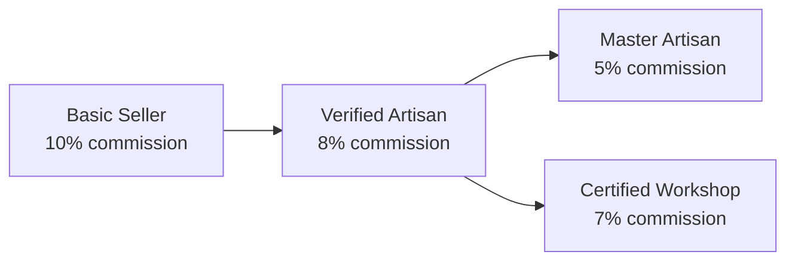
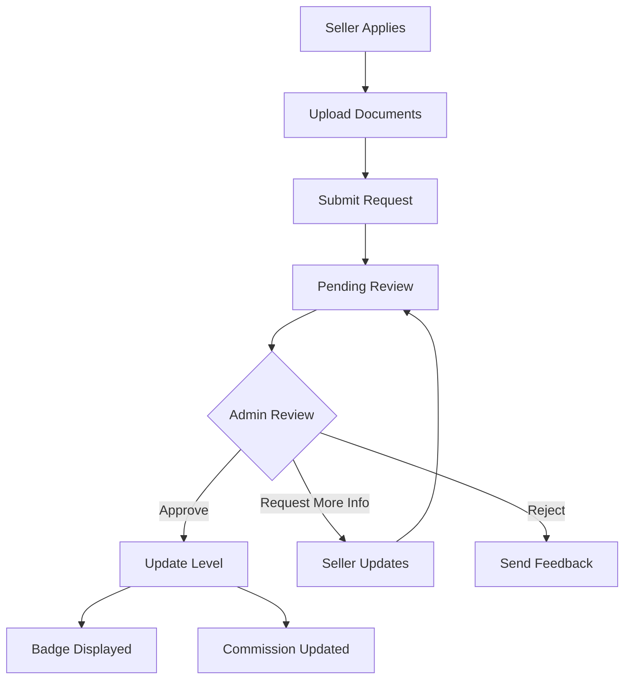

# Verification System

> 4-tier seller verification for trust and commission rates.

## Overview

Papalote Market uses a tiered verification system that rewards authentic artisans with lower commission rates and trust badges. Higher verification levels require more documentation but provide better benefits.

## Verification Tiers



### Tier Comparison

| Tier                 | Commission | Badge Color | Requirements           |
| -------------------- | ---------- | ----------- | ---------------------- |
| `basic_seller`       | 10%        | Gray        | Email verified         |
| `verified_artisan`   | 8%         | Blue        | ID + craft photos      |
| `master_artisan`     | 5%         | Gold        | Awards, certifications |
| `certified_workshop` | 7%         | Purple      | Business docs, team    |

## Key Files

| File                                      | Purpose                  |
| ----------------------------------------- | ------------------------ |
| `lib/types/verification.ts`               | Verification types       |
| `lib/constants/verification.ts`           | Tier constants           |
| `components/common/VerificationBadge.tsx` | Badge display            |
| `app/admin/verificaciones/page.tsx`       | Admin verification panel |

---

## Verification Levels

### Basic Seller

**Requirements:**

- Email verified
- Shop profile created
- At least 1 product listed

**Benefits:**

- Can list up to 20 products
- Basic analytics access
- Standard support

---

### Verified Artisan

**Requirements:**

- Government-issued ID (INE/Passport)
- Proof of address
- Photos of craft workspace
- At least 3 product photos showing creation process
- Minimum 10 sales

**Benefits:**

- 8% commission (vs 10%)
- Blue verification badge
- Up to 100 products
- Featured in "Verified Artisans" section
- Priority support

---

### Master Artisan

**Requirements:**

- All Verified Artisan requirements
- Artisan certification or award
- Recognition from cultural institution
- Minimum 100 sales
- 4.5+ rating with 50+ reviews
- 2+ years active on platform

**Benefits:**

- 5% commission
- Gold verification badge
- Unlimited products
- Homepage featuring
- Dedicated account manager
- Marketing support

---

### Certified Workshop

**Requirements:**

- Business registration (RFC)
- IMSS registration (employees)
- Workshop photos with team
- Minimum 3 artisans employed
- Fair wage documentation
- Minimum 50 sales

**Benefits:**

- 7% commission
- Purple workshop badge
- Team management features
- Bulk order handling
- B2B marketplace access

---

## VerificationBadge Component

### Usage

```tsx
import { VerificationBadge } from '@/components/common';

<VerificationBadge level="verified_artisan" size="md" showLabel />;
```

### Props

| Prop          | Type                   | Default | Description        |
| ------------- | ---------------------- | ------- | ------------------ |
| `level`       | `VerificationLevel`    | -       | Verification tier  |
| `size`        | `'sm' \| 'md' \| 'lg'` | `'md'`  | Badge size         |
| `showLabel`   | `boolean`              | `false` | Show tier name     |
| `showTooltip` | `boolean`              | `true`  | Show info on hover |

### Badge Styles

```typescript
const badgeStyles = {
  basic_seller: {
    icon: 'User',
    color: 'text-gray-500',
    bg: 'bg-gray-100',
    label: 'Vendedor',
  },
  verified_artisan: {
    icon: 'CheckCircle',
    color: 'text-blue-600',
    bg: 'bg-blue-100',
    label: 'Artesano Verificado',
  },
  master_artisan: {
    icon: 'Award',
    color: 'text-amber-600',
    bg: 'bg-amber-100',
    label: 'Maestro Artesano',
  },
  certified_workshop: {
    icon: 'Building',
    color: 'text-purple-600',
    bg: 'bg-purple-100',
    label: 'Taller Certificado',
  },
};
```

---

## Verification Request

### Request Interface

```typescript
interface VerificationRequest {
  id: string;
  sellerId: string;
  sellerName: string;
  requestedLevel: VerificationLevel;
  status: 'pending' | 'in_review' | 'approved' | 'rejected';

  // Documents
  documents: {
    governmentId?: string; // URL to uploaded file
    proofOfAddress?: string;
    curp?: string;
    rfc?: string;
    businessRegistration?: string;
  };

  // Craft Evidence
  craftPhotos: string[];
  craftVideos?: string[];
  workshopPhotos?: string[];
  certifications?: string[];

  // Review
  reviewedBy?: string;
  reviewNotes?: string;
  approvedLevel?: VerificationLevel;
  rejectionReason?: string;

  // Timestamps
  createdAt: string;
  updatedAt: string;
}
```

### Request Flow



---

## Verification Form

### Required Documents by Level

```typescript
const requiredDocuments = {
  verified_artisan: [
    { id: 'governmentId', label: 'Identificación oficial (INE/Pasaporte)', required: true },
    { id: 'proofOfAddress', label: 'Comprobante de domicilio', required: true },
    {
      id: 'craftPhotos',
      label: 'Fotos del proceso de creación (mínimo 3)',
      required: true,
      min: 3,
    },
    { id: 'workshopPhotos', label: 'Fotos del taller/espacio de trabajo', required: false },
  ],
  master_artisan: [
    // All verified_artisan requirements plus:
    { id: 'certifications', label: 'Certificaciones o premios', required: true },
    { id: 'craftVideos', label: 'Video del proceso de creación', required: true },
  ],
  certified_workshop: [
    { id: 'rfc', label: 'RFC de la empresa', required: true },
    { id: 'businessRegistration', label: 'Acta constitutiva', required: true },
    { id: 'imssRegistration', label: 'Registro IMSS', required: true },
    { id: 'workshopPhotos', label: 'Fotos del taller con equipo', required: true, min: 5 },
    { id: 'fairWageDoc', label: 'Documentación de salario justo', required: true },
  ],
};
```

### Verification Form Component

```tsx
<VerificationForm
  currentLevel={seller.verificationLevel}
  targetLevel="verified_artisan"
  onSubmit={handleSubmitVerification}
>
  <DocumentUpload
    name="governmentId"
    label="Identificación oficial"
    accept="image/*,.pdf"
    required
  />
  <MultipleUpload name="craftPhotos" label="Fotos del proceso" accept="image/*" min={3} max={10} />
  {/* ... */}
</VerificationForm>
```

---

## Admin Verification Panel

### Verification Queue

```tsx
// app/admin/verificaciones/page.tsx
<VerificationQueue
  requests={pendingRequests}
  onReview={handleOpenReview}
  onApprove={handleApprove}
  onReject={handleReject}
/>
```

### Review Modal

```tsx
<VerificationReviewModal
  request={selectedRequest}
  onApprove={(level) => approveRequest(request.id, level)}
  onReject={(reason) => rejectRequest(request.id, reason)}
  onRequestInfo={(message) => requestMoreInfo(request.id, message)}
/>
```

### Admin Actions

| Action        | Description                          |
| ------------- | ------------------------------------ |
| Approve       | Accept at requested level            |
| Approve Lower | Accept at lower level than requested |
| Request Info  | Ask for additional documents         |
| Reject        | Deny with reason                     |

---

## SellerVerification State

### Interface

```typescript
interface SellerVerification {
  status: 'unverified' | 'pending' | 'verified';
  level: VerificationLevel;
  badges: Badge[];
  verifiedAt?: string;
  expiresAt?: string;

  // Permissions
  canSell: boolean;
  canCreateListings: boolean;
  maxListings: number;
  canAccessAnalytics: boolean;

  // Metrics
  trustScore: number; // 0-100
  commissionRate: number; // 5-10%
}
```

### Permission Levels

| Permission         | Basic | Verified | Master    | Workshop  |
| ------------------ | ----- | -------- | --------- | --------- |
| Max Listings       | 20    | 100      | Unlimited | Unlimited |
| Analytics          | Basic | Full     | Full      | Full      |
| Featured Placement | No    | Yes      | Priority  | Yes       |
| Custom Orders      | No    | Yes      | Yes       | Yes       |
| Bulk Orders        | No    | No       | Yes       | Yes       |

---

## Trust Score

### Calculation Factors

```typescript
const calculateTrustScore = (seller: ExtendedMakerProfile): number => {
  let score = 0;

  // Verification level (0-30 points)
  const levelScores = {
    basic_seller: 10,
    verified_artisan: 20,
    master_artisan: 30,
    certified_workshop: 25,
  };
  score += levelScores[seller.verificationLevel];

  // Rating (0-25 points)
  score += (seller.rating / 5) * 25;

  // Response rate (0-15 points)
  score += (seller.responseRate / 100) * 15;

  // Sales history (0-15 points)
  const salesScore = Math.min(seller.salesCount / 100, 1) * 15;
  score += salesScore;

  // Account age (0-15 points)
  const monthsActive = getMonthsActive(seller.createdAt);
  const ageScore = Math.min(monthsActive / 24, 1) * 15;
  score += ageScore;

  return Math.round(score);
};
```

### Trust Score Display

```tsx
<TrustScore score={seller.trustScore} showBreakdown={true} size="lg" />
```

---

## Badge System

### Badge Types

| Type            | Description                         |
| --------------- | ----------------------------------- |
| `verification`  | Earned through verification process |
| `achievement`   | Earned through performance          |
| `certification` | External certifications             |

### Badge Interface

```typescript
interface Badge {
  id: string;
  name: string;
  type: 'verification' | 'achievement' | 'certification';
  icon: string;
  color: string;
  bgColor: string;
  description: string;
  earnedAt: string;
  expiresAt?: string; // Some badges expire
}
```

### Common Badges

| Badge            | Type          | Criteria                |
| ---------------- | ------------- | ----------------------- |
| Verified Artisan | verification  | Complete verification   |
| Top Seller       | achievement   | 100+ sales              |
| Quick Responder  | achievement   | < 1hr response time     |
| 5-Star Rated     | achievement   | 5.0 rating, 20+ reviews |
| Eco-Friendly     | certification | Sustainable practices   |

---

## Commission Calculation

### Rate by Level

```typescript
const commissionRates: Record<VerificationLevel, number> = {
  basic_seller: 0.1, // 10%
  verified_artisan: 0.08, // 8%
  master_artisan: 0.05, // 5%
  certified_workshop: 0.07, // 7%
};
```

### Commission Example

```typescript
const calculateCommission = (saleAmount: number, level: VerificationLevel): number => {
  const rate = commissionRates[level];
  return saleAmount * rate;
};

// Example: $1,000 sale
// Basic seller: $100 commission → $900 earnings
// Master artisan: $50 commission → $950 earnings
```

---

## Verification Expiry

### Annual Re-verification

```typescript
const VERIFICATION_VALIDITY_DAYS = 365;

const isVerificationExpiring = (verification: SellerVerification): boolean => {
  if (!verification.expiresAt) return false;
  const expiryDate = new Date(verification.expiresAt);
  const warningDate = new Date();
  warningDate.setDate(warningDate.getDate() + 30); // 30-day warning
  return expiryDate <= warningDate;
};
```

### Renewal Process

1. System sends reminder 30 days before expiry
2. Seller updates documents if needed
3. Quick review (faster than initial)
4. Verification renewed for another year

---

## Related Documentation

- [User Flows - Verification Workflow](../FLOWS.md#6-admin-workflows)
- [Data Models - Verification Types](../DATA-MODELS.md#verification-system)
- [Seller Dashboard](./seller-dashboard.md)
- [Authentication](./authentication.md)
